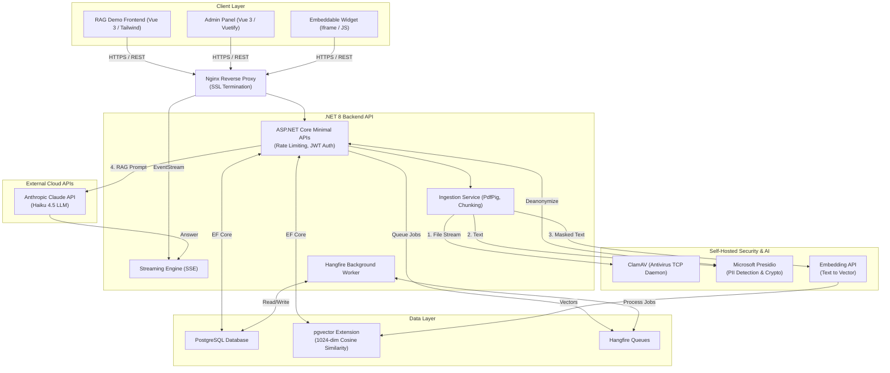

# Kosify AI Chatbot: Architecture & Topology Overview

This document provides an exhaustive breakdown of every technology, service, and API used in the project, structured to help you design your Architecture Diagrams and outline the topological structure. 

---

## 1. Complete Technology Stack

### 🌐 Frontend Layer (User Interfaces)
*   **Vue 3 (Composition API):** Core frontend framework.
*   **TypeScript:** Type-safe JavaScript for frontend logic.
*   **Vite:** Extremely fast frontend build tool.
*   **Pinia:** State management (replaces Vuex).
*   **Tailwind CSS & Headless UI:** Styling for the RAG Demo application.
*   **Vuetify 3:** Material design framework used for the robust Admin Panel.
*   **Chart.js / vue-chartjs:** For rendering analytics and metrics dashboards.
*   **Vanilla JavaScript & iframe:** Used for the embeddable chat widget (`embed.js`), allowing cross-origin usage on third-party sites.

### ⚙️ Backend & Middleware Layer (The Core API)
*   **C# & .NET 8:** Core backend programming language and framework.
*   **ASP.NET Core Minimal APIs:** Used to define lightweight, high-performance REST endpoints.
*   **Entity Framework Core 8 (EF Core):** ORM for interacting with the database.
*   **JWT (JSON Web Tokens):** For stateless, secure authentication (HMAC-SHA256) and role-based access.
*   **AspNetCoreRateLimit:** Middleware to enforce IP and endpoint-based rate limiting.
*   **Server-Sent Events (SSE):** Used for real-time, token-by-token streaming of the LLM responses to the frontend.
*   **Hangfire:** Background job processor for managing asynchronous ingestion tasks (scanning, chunking, embedding).
*   **PdfPig:** Library for extracting text and structure from uploaded PDF documents.
*   **ASP.NET Data Protection:** Provides AES-256 encryption at-rest for storing sensitive PII placeholders in the database.

### 💾 Data & Storage Layer
*   **PostgreSQL:** The primary relational database (stores tenants, users, documents, analytics, and Hangfire job queues).
*   **pgvector:** Crucial PostgreSQL extension used to store 1024-dimensional embeddings and perform high-speed similarity searches (Cosine Similarity).

### 🛡️ Security & External APIs (Microservices)
*   **ClamAV (TCP Daemon):** Self-hosted open-source antivirus engine. Every uploaded file is piped through ClamAV via TCP before hitting the disk.
*   **Microsoft Presidio (Analyzer):** Self-hosted Python service. Scans text to detect PII (Personally Identifiable Information) like names, emails, and IBANs.
*   **Microsoft Presidio (Anonymizer/Crypto):** Self-hosted Python service. Replaces detected PII with placeholders (e.g., `<PERSON_1>`) and handles deanonymization before sending the final answer to the user.
*   **Anthropic Claude API (Haiku 4.5):** The core Large Language Model (LLM) used for generating conversational answers, extracting structured JSON, and generating section metadata.
*   **Self-Hosted Embedding API (Cohere-based):** Takes semantic text chunks and converts them into 1024-dimensional vector representations.

### 🚀 Infrastructure & Deployment Layer
*   **Linux (Oracle Ubuntu):** The host operating system.
*   **Docker & Docker Compose:** Used to containerize supporting services (PostgreSQL, pgvector, ClamAV, Presidio).
*   **Nginx:** Reverse proxy server that routes internet traffic to the correct frontend or backend port and handles SSL (HTTPS).
*   **Systemd:** Linux service manager used to keep the .NET backend running continuously in the background.

---

## 2. Architectural Topology Diagrams

You can use the following structures to create your visual diagrams (e.g., in Draw.io, Visio, or PowerPoint). Below is a Mermaid.js diagram representing your system.

### System Architecture & Data Flow

### 3. Detailed Data Flows for your Presentation

If the jury asks how these components interact, use these two primary flows:

#### Flow A: Document Ingestion (The Upload Process)
1. **Upload:** User uploads a PDF via the Vue.js frontend.
2. **Reverse Proxy:** Nginx routes the request to the .NET API.
3. **Scan:** The API streams the file directly to **ClamAV** via TCP. If malicious, it rejects it instantly (HTTP 422).
4. **Queue:** If safe, a job is queued in **Hangfire** (PostgreSQL) so the user doesn't have to wait.
5. **Extraction:** A background worker uses **PdfPig** to extract text.
6. **Anonymization:** The text chunks are sent to **Microsoft Presidio** to mask sensitive PII.
7. **Embedding:** The masked text is sent to the **Embedding API**, which returns a 1024-dimensional vector.
8. **Storage:** The vector and masked text are saved to **PostgreSQL / pgvector**. The original PII placeholders are encrypted at-rest using **ASP.NET Data Protection (AES-256)**.

#### Flow B: Chat & RAG Retrieval
1. **Query:** User asks a question via the Vue frontend.
2. **Anonymize Query:** The backend sends the question to **Presidio** to mask PII (e.g., *"How much does [PERSON_1] owe?"*).
3. **Embed Query:** The masked query is sent to the **Embedding API**.
4. **Vector Search:** The API queries **pgvector** to find the most mathematically similar text chunks (Cosine Similarity), restricted by the user's `TenantId` (Multi-tenancy).
5. **Generation:** The context chunks and the query are combined into a system prompt and sent to **Anthropic Claude**.
6. **Streaming & Deanonymization:** Claude streams the answer back. The backend sends the final answer through **Presidio** to deanonymize it (changing `[PERSON_1]` back to *"Jan Peeters"*) and pushes it to the frontend via **Server-Sent Events (SSE)**.
